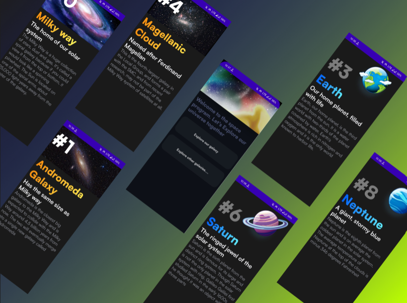

# planetApp
### Problem statement:
In our busy life we often forget how small our workspace or even our whole planet is when compaired to the whole universe. we all should try atleast once in our life to
the waste and always expanding space
### Proposed Solution:
Our application provides brief information about the planets of our galaxy and introduce them to the other galaxies of the universe to spark the heart of the users to motivates 
them to research further
### Application images:

### Functionality & Concepts used:
A very simple application with eye pleasing and interacting UI
Used compose navigation with navHost , Navgraph and Nav controller 
